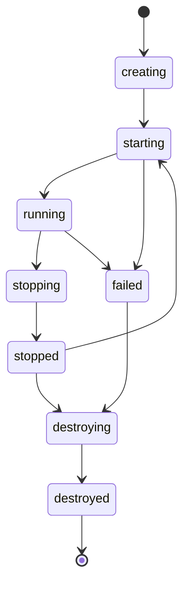

# COCO Sandbox Master Plan

**Version:** 2.0 (Updated with Critical Feedback)  
**Date:** 2026-03-20  
**Status:** Ready for Implementation

---

## Table of Contents

1. [Executive Summary](#executive-summary)
2. [Critical Feedback & Improvements](#critical-feedback--improvements)
3. [MVP Specification](#mvp-specification)
4. [Architecture Design](#architecture-design)
5. [File-by-File Implementation Guide](#file-by-file-implementation-guide)
6. [Security & Isolation](#security--isolation)
7. [Risk Analysis](#risk-analysis)
8. [Best Practices](#best-practices)
9. [AI Governance](#ai-governance)
10. [Testing Strategy](#testing-strategy)
11. [Monitoring & Observability](#monitoring--observability)
12. [Scalability Plan](#scalability-plan)
13. [Conclusion](#conclusion)

---

# Part 1: Executive Summary

## Vision

COCO is an AI-powered coding workspace that enables users to build applications through natural language prompts. The system combines AI assistance with a full-featured IDE, live preview, and deployment capabilities.

## Current State Analysis

### What Exists
- ✅ Landing page with prompt input (`app/page.tsx`)
- ✅ Workspace UI layout (`app/workspace/page.tsx`)
- ✅ In-memory file system (Zustand store)
- ✅ Monaco code editor integration
- ✅ File explorer with tree view
- ✅ AI integration layer (OpenRouter client)
- ✅ Terminal component (XTerm.js)
- ✅ Preview proxy API routes
- ✅ AI governance framework
- ✅ shadcn/ui component library

### What's Missing
- ❌ Workspace files are in-memory only (not persisted)
- ❌ Preview shows COCO's own app, not workspace files
- ❌ No sandbox runtime for isolated execution
- ❌ No file sync between workspace store and filesystem
- ❌ Terminal not connected to workspace runtime
- ❌ AI writes to store, not actual files

### Critical Problem

**The Disconnect:**
```
Workspace Store (In-Memory)          Real Filesystem
├── app/page.tsx (Tetris)     ≠     ├── app/page.tsx (COCO landing)
├── components/               ≠     ├── components/workspace/
└── lib/                      ≠     └── lib/workspace/

Preview → localhost:3000 → Shows COCO, not workspace files ❌
```

### Success Criteria

1. **Functional Workspace:** AI creates files → Files persist → Preview shows them
2. **Isolation:** Each workspace runs in isolated environment
3. **Security:** Proper sandboxing, resource limits, RLS policies
4. **Performance:** < 5s sandbox creation, < 100ms file operations
5. **Reliability:** 99.9% uptime, zero data loss

---

# Part 2: Critical Feedback & Improvements

## Overview

This section addresses 8 critical improvements identified through expert review. These changes transform the plan from good to production-ready.

## 1. Runtime Service Separation

### Problem
Original plan placed too much responsibility on Next.js API routes for container orchestration, WebSocket management, and sandbox lifecycle.

### Solution
**Separate Runtime Service**

```
Next.js App (Frontend + Auth Facade)
        ↓
Runtime Service (Sandbox Orchestration)
        ↓
Docker Containers (Isolated Workspaces)
```

**Benefits:**
- Frontend remains lightweight
- Container lifecycle independent of app restarts
- WebSocket/terminal streams live outside app router
- Better separation of concerns
- Easier to scale and maintain

### Decision
✅ Create separate `runtime-service/` with its own process
✅ Next.js only acts as auth facade and proxy
✅ Runtime service handles all sandbox operations

## 2. Dev Server Strategy

### Problem
Running `npm run dev` per workspace in production is expensive and slow.

### Solution
**Phased Approach**

**MVP (Phase 1):**
- Use `npm run dev` for simplicity
- Acceptable for initial users
- Proves the architecture

**Production (Phase 2+):**
- Implement warm container pool
- Use build cache strategies
- Consider Vite for faster startup
- Implement start/stop policies
- Optimize resource usage

### Decision
✅ Start with `npm run dev` in MVP
✅ Plan for optimization in Phase 2
✅ Monitor costs and performance from day 1

## 3. Sandbox State Machine

### Problem
Original plan lacked explicit state management, risking race conditions.

### Solution
**Explicit State Machine**

```typescript
type SandboxState = 
  | 'creating'
  | 'starting'
  | 'running'
  | 'stopping'
  | 'stopped'
  | 'failed'
  | 'destroying'
  | 'destroyed';
```

**Allowed Transitions:**
```
creating → starting
starting → running | failed
running → stopping | failed
stopping → stopped
stopped → starting | destroying
failed → destroying
destroying → destroyed
```

**Rules:**
- Preview URL only available when `running`
- File writes only when not `destroying` or `destroyed`
- Start/stop/restart must be serialized per workspace
- State transitions must be atomic
- Failed states must be recoverable

### Decision
✅ Implement explicit state machine in runtime service
✅ Enforce transition rules
✅ Add state validation to all operations

## 4. Source of Truth

### Problem
Original plan wasn't explicit enough about which system owns the data.

### Solution
**Hard Rule: Sandbox Filesystem is Source of Truth**

```
Sandbox Filesystem = TRUTH
Frontend Store = Cache/Projection ONLY
```

**Implications:**
- AI writes → Backend → Sandbox filesystem
- Editor reads → Sync from sandbox
- Preview reads → Sandbox dev server
- Terminal/logs → Sandbox runtime
- Zustand NEVER the only source of truth

**Anti-patterns to avoid:**
- ❌ Writing to store without syncing to sandbox
- ❌ Treating store as equal source of truth
- ❌ Allowing store and sandbox to diverge

### Decision
✅ Sandbox filesystem is authoritative
✅ Frontend store is synchronized cache
✅ All writes go through sandbox
✅ Sync conflicts resolved in favor of sandbox

## 5. Preview Routing Model

### Problem
Original plan mentioned subdomains but didn't specify MVP approach.

### Solution
**Path-Based Proxy for MVP**

```
Preview URL: /api/preview/:workspaceId/*
```

**Example:**
```
/api/preview/ws_abc123/ → Sandbox dev server
/api/preview/ws_abc123/_next/static/... → Sandbox assets
```

**Why path-based:**
- Simpler than dynamic subdomains
- Easier auth and routing
- Works locally without DNS
- Faster to implement
- Can migrate to subdomains later

**Future (Post-MVP):**
```
Subdomain: ws-abc123.preview.coco.dev
```

### Decision
✅ Use path-based proxy in MVP
✅ Plan subdomain migration for Phase 2
✅ Keep preview routing abstracted in code

## 6. Command Allowlist Refinement

### Problem
Original allowlist was too broad and lacked detail.

### Solution
**Strict Command Policy**

**Allowed in MVP:**
```typescript
const ALLOWED_COMMANDS = [
  'npm install',
  'npm run dev',
  'npm run build',
  'npm run lint',
  'npm run typecheck',
];
```

**Additional Constraints:**
- ✅ Specific working directory only
- ✅ No shell expansion (`bash -c`, `sh -c`)
- ✅ No command chaining (`&&`, `||`, `;`)
- ✅ Environment variables whitelist
- ✅ Rate limiting per workspace
- ✅ Audit logging required
- ✅ Timeout enforcement (30s default)

**Explicitly Forbidden:**
```typescript
const FORBIDDEN = [
  'curl', 'wget', 'ssh', 'sudo', 'docker',
  'rm -rf', 'chmod', 'chown', 'kill',
  // Any command with shell metacharacters
];
```

**Special Considerations:**

**`npm install`:**
- High risk surface
- Must be rate limited
- Requires approval for new packages
- Logged separately
- May need policy restrictions

**`postinstall` scripts:**
- Disabled by default in MVP
- Can be enabled with explicit approval
- Requires additional sandboxing

### Decision
✅ Implement strict allowlist
✅ Add command validation layer
✅ Require approval for risky operations
✅ Log all command executions

## 7. Terminal Security Model

### Problem
Original plan lacked detail on terminal security.

### Solution
**Layered Terminal Security**

**MVP Approach:**
- ❌ No free interactive shell
- ✅ Command execution API only
- ✅ Output streaming
- ✅ Predefined commands only

**Security Layers:**

**1. Session Binding:**
```typescript
interface TerminalSession {
  id: string;
  workspaceId: string;
  userId: string;
  token: string; // Short-lived
  createdAt: Date;
  expiresAt: Date;
}
```

**2. Attach Tokens:**
- Short-lived (5 minutes)
- Single-use or limited reuse
- Bound to user + workspace
- Validated on every message

**3. Output Management:**
- Max buffer size (10MB)
- Backpressure handling
- Truncation after limit
- Automatic cleanup

**4. Session Limits:**
- Max 3 concurrent sessions per workspace
- Max 10 sessions per user
- Automatic timeout after 30 min idle

**5. Command History:**
- Retained for 7 days
- Audit logged
- User accessible
- Admin reviewable

**Post-MVP (Interactive Terminal):**
- Restricted shell environment
- Command filtering
- Output sanitization
- Session recording

### Decision
✅ Start with command execution API
✅ No free shell in MVP
✅ Implement full security model
✅ Plan interactive terminal for Phase 2

## 8. Persistence Strategy

### Problem
Original plan didn't specify how files survive restarts.

### Solution
**Persistent Volume Model for MVP**

**Architecture:**
```
Docker Container
    ↓
Volume Mount: /workspace
    ↓
Host Directory: /var/coco/workspaces/:id
    ↓
Persistent Storage
```

**Characteristics:**
- ✅ Files survive container restart
- ✅ Files survive dev server restart
- ✅ Simple to implement
- ✅ Good performance
- ✅ Easy backup/restore

**Lifecycle:**
```
Create Workspace
    ↓
Create Volume
    ↓
Mount to Container
    ↓
Files Written
    ↓
Container Stops
    ↓
Volume Persists
    ↓
Container Restarts
    ↓
Volume Remounts
    ↓
Files Still There ✅
```

**Backup Strategy:**
```typescript
// Periodic snapshots
setInterval(async () => {
  await snapshotWorkspace(workspaceId);
}, 15 * 60 * 1000); // Every 15 minutes
```

**Not in MVP:**
- Object storage snapshots
- Git as source of truth
- Distributed volume layer
- Cross-host migration

**Future Considerations:**
- Migrate to object storage for scale
- Implement git-backed workspaces
- Add cross-region replication

### Decision
✅ Use persistent volumes in MVP
✅ Implement periodic snapshots
✅ Plan object storage migration for scale
✅ Keep persistence layer abstracted

---

# Part 3: MVP Specification

## Goals

COCO MVP must achieve:

1. ✅ Create isolated workspace runtime
2. ✅ Write and read real files in sandbox
3. ✅ Run dev server in sandbox
4. ✅ Show preview from sandbox
5. ✅ Stream logs/output to UI
6. ✅ Keep editor, preview, and runtime synchronized

**Core Flow:**
```
AI writes → Sandbox files → Dev server reload → Preview update
```

## Non-Goals (Explicitly Out of Scope)

These features are deferred to post-MVP:

- ❌ GitHub write/commit/PR workflows
- ❌ Subdomain preview URLs
- ❌ Multi-user collaboration
- ❌ Kubernetes orchestration
- ❌ Advanced autoscaling
- ❌ Full interactive shell terminal
- ❌ Enterprise deployment features
- ❌ Billing and payments
- ❌ Team permissions
- ❌ Production deployment workflows
- ❌ Version control UI
- ❌ Advanced debugging tools
- ❌ Performance profiling
- ❌ A/B testing
- ❌ Analytics dashboard

## Source of Truth Statement

**This is a hard, non-negotiable rule:**

> **Sandbox filesystem is the source of truth.**  
> **Frontend store is only a synchronized cache.**

**What this means:**

```typescript
// ✅ CORRECT
async function createFile(path: string, content: string) {
  // 1. Write to sandbox
  await sandboxService.writeFile(workspaceId, path, content);
  
  // 2. Update local cache
  workspaceStore.updateFileCache(path, content);
}

// ❌ WRONG
async function createFile(path: string, content: string) {
  // Writing to store without sandbox
  workspaceStore.createFile(path, content);
}
```

**Implications:**
- All file operations must go through sandbox
- Store updates are consequences, not causes
- Conflicts resolved in favor of sandbox
- Store can be rebuilt from sandbox at any time

## Sandbox State Machine

### States

```typescript
type SandboxState = 
  | 'creating'   // Container being created
  | 'starting'   // Dev server starting
  | 'running'    // Ready for use
  | 'stopping'   // Graceful shutdown
  | 'stopped'    // Cleanly stopped
  | 'failed'     // Error state
  | 'destroying' // Being deleted
  | 'destroyed'; // Fully removed
```

### State Transitions



### Transition Rules

**From `creating`:**
- ✅ → `starting` (container created successfully)
- ❌ → `failed` (container creation failed)

**From `starting`:**
- ✅ → `running` (dev server started)
- ❌ → `failed` (dev server failed to start)

**From `running`:**
- ✅ → `stopping` (user requested stop)
- ❌ → `failed` (crash or error)

**From `stopping`:**
- ✅ → `stopped` (clean shutdown)

**From `stopped`:**
- ✅ → `starting` (user requested restart)
- ✅ → `destroying` (user requested delete)

**From `failed`:**
- ✅ → `destroying` (cleanup required)

**From `destroying`:**
- ✅ → `destroyed` (cleanup complete)

### Operation Permissions

**Preview URL:**
- ✅ Available when: `running`
- ❌ Not available when: any other state

**File Operations:**
- ✅ Allowed when: `running`, `stopped`
- ❌ Not allowed when: `destroying`, `destroyed`, `failed`

**Start/Stop:**
- Must be serialized per workspace
- No concurrent state transitions
- Use mutex/lock mechanism

## Runtime Service Boundary

### Architecture Decision

**Runtime service is separate from Next.js app.**

```
┌─────────────────────┐
│   Next.js App       │
│   (Port 3000)       │
│   - Frontend        │
│   - Auth facade     │
│   - API proxy       │
└──────────┬──────────┘
           │ HTTP
           ↓
┌─────────────────────┐
│  Runtime Service    │
│   (Port 3001)       │
│   - Sandbox manager │
│   - Docker control  │
│   - File operations │
│   - Log streaming   │
└──────────┬──────────┘
           │ Docker API
           ↓
┌─────────────────────┐
│  Docker Containers  │
│   - Workspace #1    │
│   - Workspace #2    │
│   - Workspace #N    │
└─────────────────────┘
```

### Why Separate?

1. **Stability:** Container lifecycle independent of web server
2. **Performance:** Heavy operations don't block web requests
3. **Scalability:** Can scale runtime service independently
4. **Reliability:** Web server restart doesn't kill sandboxes
5. **Simplicity:** Clear separation of concerns

### Communication

**Next.js → Runtime Service:**
- HTTP REST API
- JSON request/response
- Internal auth token
- No public exposure

**Runtime Service → Docker:**
- Docker SDK (dockerode)
- Direct container control
- Volume management
- Network configuration

### Deployment

**MVP:**
- Both services on same host
- Runtime service as separate process
- Shared Docker daemon

**Production:**
- Runtime service on dedicated hosts
- Load balanced
- Separate from web tier

## Preview Routing Model

### MVP Decision: Path-Based Proxy

**URL Pattern:**
```
/api/preview/:workspaceId/*
```

**Examples:**
```
/api/preview/ws_abc123/
/api/preview/ws_abc123/about
/api/preview/ws_abc123/_next/static/chunks/main.js
```

### Implementation

```typescript
// app/api/preview/[workspaceId]/[...path]/route.ts
export async function GET(
  request: Request,
  { params }: { params: { workspaceId: string; path: string[] } }
) {
  // 1. Validate workspace access
  await validateWorkspaceAccess(userId, params.workspaceId);
  
  // 2. Get sandbox status
  const sandbox = await runtimeClient.getSandboxStatus(params.workspaceId);
  
  if (sandbox.status !== 'running') {
    return new Response('Sandbox not running', { status: 503 });
  }
  
  // 3. Proxy to sandbox dev server
  const targetPath = params.path.join('/');
  const targetUrl = `http://localhost:${sandbox.devServerPort}/${targetPath}`;
  
  const response = await fetch(targetUrl);
  return response;
}
```

### Why Path-Based?

**Advantages:**
- ✅ Simple to implement
- ✅ Works locally without DNS
- ✅ Easy auth and routing
- ✅ No certificate management
- ✅ Faster to deploy

**Disadvantages:**
- ⚠️ Longer URLs
- ⚠️ Relative path issues (solvable)
- ⚠️ Less "native" feeling

### Future: Subdomain Model

**Post-MVP:**
```
ws-abc123.preview.coco.dev
```

**Requirements:**
- Wildcard DNS
- Wildcard SSL certificate
- Nginx/Traefik routing
- More complex infrastructure

## Persistence Model

### MVP Decision: Persistent Volumes

**Architecture:**
```
Container: /workspace
    ↓ (mount)
Host: /var/coco/workspaces/:workspaceId
    ↓ (storage)
Disk: Persistent storage
```

### Volume Lifecycle

**Create:**
```typescript
async function createWorkspace(workspaceId: string) {
  // 1. Create host directory
  const workspacePath = `/var/coco/workspaces/${workspaceId}`;
  await fs.mkdir(workspacePath, { recursive: true });
  
  // 2. Initialize with template
  await copyTemplate('nextjs', workspacePath);
  
  // 3. Create container with volume mount
  const container = await docker.createContainer({
    Image: 'coco-workspace:latest',
    Volumes: {
      '/workspace': {}
    },
    HostConfig: {
      Binds: [`${workspacePath}:/workspace`]
    }
  });
  
  return container;
}
```

**Restart:**
```typescript
async function restartSandbox(workspaceId: string) {
  // 1. Stop container
  await container.stop();
  
  // 2. Start container
  // Volume automatically remounts
  await container.start();
  
  // Files are still there! ✅
}
```

**Backup:**
```typescript
async function backupWorkspace(workspaceId: string) {
  const workspacePath = `/var/coco/workspaces/${workspaceId}`;
  const backupPath = `/var/coco/backups/${workspaceId}-${Date.now()}.tar.gz`;
  
  await exec(`tar -czf ${backupPath} -C ${workspacePath} .`);
  
  // Optional: Upload to S3
  await uploadToS3(backupPath);
}
```

### Benefits

- ✅ Simple and reliable
- ✅ Good performance
- ✅ Files survive restarts
- ✅ Easy to backup
- ✅ Easy to restore
- ✅ No complex distributed system

### Limitations

- ⚠️ Tied to single host
- ⚠️ No automatic replication
- ⚠️ Manual backup required
- ⚠️ Limited by disk space

### Future Improvements

**Phase 2:**
- Object storage snapshots
- Automatic replication
- Cross-host migration
- Distributed volumes

## Terminal Security Model

### MVP Approach: Command Execution API

**No free shell in MVP.** Terminal shows output only.

### Architecture

```typescript
interface TerminalSession {
  id: string;
  workspaceId: string;
  userId: string;
  token: string;
  createdAt: Date;
  expiresAt: Date;
  maxCommands: number;
  commandsExecuted: number;
}
```

### Command Execution Flow

```
User clicks "Run" → Frontend → Backend → Runtime Service → Sandbox
                                                              ↓
User sees output ← Frontend ← Backend ← Runtime Service ← Command Output
```

### Security Layers

**1. Session Management:**
```typescript
async function createTerminalSession(
  userId: string,
  workspaceId: string
): Promise<TerminalSession> {
  const token = generateSecureToken();
  
  return {
    id: nanoid(),
    workspaceId,
    userId,
    token,
    createdAt: new Date(),
    expiresAt: new Date(Date.now() + 5 * 60 * 1000), // 5 min
    maxCommands: 100,
    commandsExecuted: 0,
  };
}
```

**2. Command Validation:**
```typescript
function validateCommand(command: string): boolean {
  // Check allowlist
  const allowed = ALLOWED_COMMANDS.some(cmd => 
    command.startsWith(cmd)
  );
  
  if (!allowed) return false;
  
  // Check for shell metacharacters
  const dangerous = /[;&|`$(){}[\]<>]/.test(command);
  if (dangerous) return false;
  
  // Check for path traversal
  if (command.includes('..')) return false;
  
  return true;
}
```

**3. Output Management:**
```typescript
class OutputBuffer {
  private buffer: string[] = [];
  private maxSize = 10 * 1024 * 1024; // 10MB
  private currentSize = 0;
  
  append(data: string) {
    if (this.currentSize + data.length > this.maxSize) {
      // Truncate old data
      this.buffer.shift();
    }
    
    this.buffer.push(data);
    this.currentSize += data.length;
  }
  
  getOutput(): string {
    return this.buffer.join('');
  }
}
```

**4. Rate Limiting:**
```typescript
const terminalRateLimit = new Ratelimit({
  redis: Redis.fromEnv(),
  limiter: Ratelimit.slidingWindow(60, "1 m"),
});

async function executeCommand(
  sessionId: string,
  command: string
) {
  const session = await getSession(sessionId);
  
  // Check rate limit
  const { success } = await terminalRateLimit.limit(
    `terminal:${session.userId}`
  );
  
  if (!success) {
    throw new Error('Rate limit exceeded');
  }
  
  // Execute command
  // ...
}
```

### Post-MVP: Interactive Terminal

**Phase 2 features:**
- Restricted shell (rbash)
- Command filtering
- Output sanitization
- Session recording
- Replay capability

## Minimal API Contract

### Runtime Service Endpoints

#### Create Sandbox

```
POST /runtime/sandboxes
```

**Request:**
```json
{
  "workspaceId": "ws_123",
  "template": "nextjs",
  "userId": "user_456"
}
```

**Response:**
```json
{
  "sandboxId": "sb_789",
  "workspaceId": "ws_123",
  "status": "creating",
  "createdAt": "2026-03-20T23:00:00Z"
}
```

#### Get Status

```
GET /runtime/sandboxes/:workspaceId/status
```

**Response:**
```json
{
  "workspaceId": "ws_123",
  "sandboxId": "sb_789",
  "status": "running",
  "devServerPort": 3000,
  "previewPath": "/api/preview/ws_123/",
  "startedAt": "2026-03-20T23:00:05Z",
  "lastSeenAt": "2026-03-20T23:30:00Z"
}
```

#### Write File

```
POST /runtime/sandboxes/:workspaceId/files/write
```

**Request:**
```json
{
  "path": "app/page.tsx",
  "content": "export default function Page() { ... }"
}
```

**Response:**
```json
{
  "success": true,
  "path": "app/page.tsx",
  "size": 1234,
  "modifiedAt": "2026-03-20T23:00:10Z"
}
```

#### Read File

```
GET /runtime/sandboxes/:workspaceId/files/read?path=app/page.tsx
```

**Response:**
```json
{
  "path": "app/page.tsx",
  "content": "export default function Page() { ... }",
  "size": 1234,
  "modifiedAt": "2026-03-20T23:00:10Z"
}
```

#### List Files

```
GET /runtime/sandboxes/:workspaceId/files/list?path=app
```

**Response:**
```json
{
  "path": "app",
  "files": [
    {
      "name": "page.tsx",
      "type": "file",
      "size": 1234,
      "modifiedAt": "2026-03-20T23:00:10Z"
    },
    {
      "name": "layout.tsx",
      "type": "file",
      "size": 567,
      "modifiedAt": "2026-03-20T23:00:05Z"
    },
    {
      "name": "components",
      "type": "directory",
      "modifiedAt": "2026-03-20T23:00:00Z"
    }
  ]
}
```

#### Delete File

```
DELETE /runtime/sandboxes/:workspaceId/files
```

**Request:**
```json
{
  "path": "components/Hero.tsx"
}
```

**Response:**
```json
{
  "success": true,
  "path": "components/Hero.tsx"
}
```

#### Execute Command

```
POST /runtime/sandboxes/:workspaceId/commands
```

**Request:**
```json
{
  "command": "npm run dev",
  "timeout": 30000
}
```

**Response:**
```json
{
  "commandId": "cmd_123",
  "status": "running",
  "startedAt": "2026-03-20T23:00:15Z"
}
```

#### Get Logs

```
GET /runtime/sandboxes/:workspaceId/logs?lines=100
```

**Response:**
```json
{
  "logs": [
    {
      "timestamp": "2026-03-20T23:00:15Z",
      "level": "info",
      "message": "Dev server started on port 3000"
    },
    {
      "timestamp": "2026-03-20T23:00:20Z",
      "level": "info",
      "message": "Compiled successfully"
    }
  ]
}
```

#### Stop Sandbox

```
POST /runtime/sandboxes/:workspaceId/stop
```

**Response:**
```json
{
  "workspaceId": "ws_123",
  "status": "stopping",
  "stoppedAt": "2026-03-20T23:30:00Z"
}
```

#### Restart Sandbox

```
POST /runtime/sandboxes/:workspaceId/restart
```

**Response:**
```json
{
  "workspaceId": "ws_123",
  "status": "starting",
  "restartedAt": "2026-03-20T23:30:05Z"
}
```

#### Destroy Sandbox

```
DELETE /runtime/sandboxes/:workspaceId
```

**Response:**
```json
{
  "workspaceId": "ws_123",
  "status": "destroying",
  "destroyedAt": "2026-03-20T23:30:10Z"
}
```

### Next.js API Facade

All Next.js routes proxy to runtime service with auth validation:

```typescript
// app/api/sandbox/[workspaceId]/files/write/route.ts
export async function POST(
  request: Request,
  { params }: { params: { workspaceId: string } }
) {
  // 1. Validate auth
  const session = await getSession();
  if (!session) {
    return new Response('Unauthorized', { status: 401 });
  }
  
  // 2. Validate workspace ownership
  const hasAccess = await validateWorkspaceAccess(
    session.user.id,
    params.workspaceId
  );
  
  if (!hasAccess) {
    return new Response('Forbidden', { status: 403 });
  }
  
  // 3. Proxy to runtime service
  const body = await request.json();
  const response = await runtimeClient.writeFile(
    params.workspaceId,
    body.path,
    body.content
  );
  
  return Response.json(response);
}
```

## Frontend Sync Model

### When AI Builds

**Flow:**
```
1. User approves AI plan
2. Backend executes actions
3. Runtime service writes files
4. Frontend receives results
5. Zustand updates cache
6. Preview proxy shows changes
7. Output panel logs actions
```

**Implementation:**
```typescript
async function executeAIPlan(planId: string) {
  // 1. Lock editor
  workspaceStore.setState({ lockedByAI: true });
  
  // 2. Execute actions
  for (const action of plan.actions) {
    if (action.type === 'create_file') {
      // Write to sandbox
      await sandboxService.writeFile(
        workspaceId,
        action.path,
        action.content
      );
      
      // Update cache
      workspaceStore.updateFileCache(action.path, action.content);
      
      // Log to output
      outputPanel.log(`Created ${action.path}`);
    }
  }
  
  // 3. Unlock editor
  workspaceStore.setState({ lockedByAI: false });
